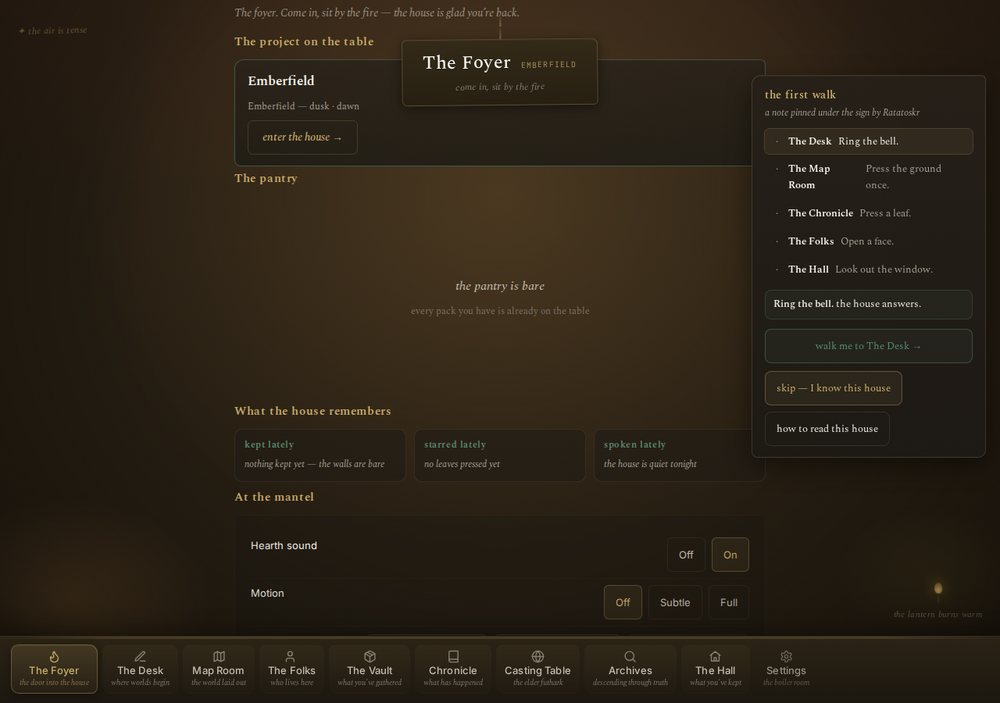
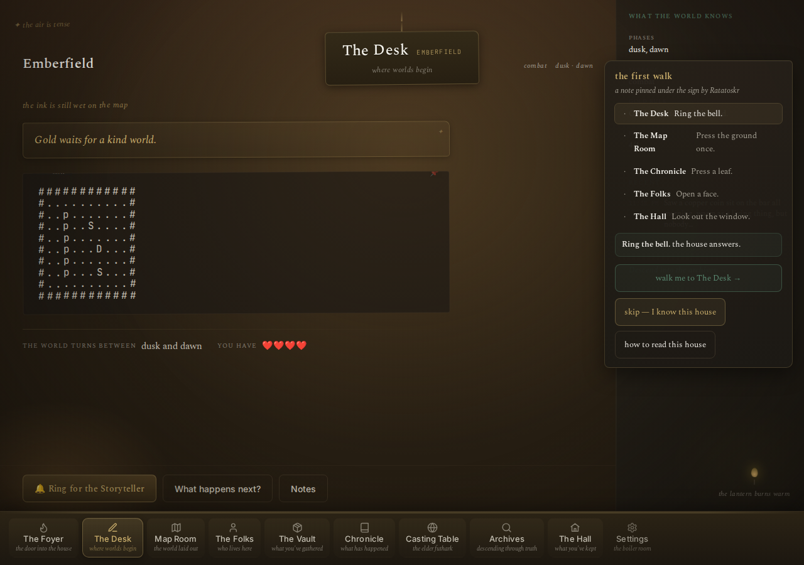

# Getting started

This gets the engine running on your own computer and walks you
through building your own world. No story content is required to
try it - a demonstration world (Emberfield) ships with the engine.

## What you need

| Tool | Why | Check you have it |
|---|---|---|
| Python 3.11+ | The engine runs on it | `python3 --version` |
| [`uv`](https://docs.astral.sh/uv/) | Installs dependencies, runs the CLIs | `uv --version` |
| A local model server | Runs the model that drafts prose | see below |
| A pulled model | The thing the server runs | see below |

The engine talks to any OpenAI-compatible `/v1/chat/completions`
server. The practical target right now is a small local model that
can run on the machine the player already has, even on CPU. Two
common options:

- **[llama.cpp](https://github.com/ggerganov/llama.cpp)** — the
  engine's primary OpenAI-compatible path. Point it at
  `VEFR_LLAMACPP_URL` (default `http://127.0.0.1:8081`).
- **[Ollama](https://ollama.com)** — simpler to install on many
  machines. Set `VEFR_MODEL` to your pulled model's name and use
  Ollama's OpenAI-compatible endpoint:
  `VEFR_LLAMACPP_URL=http://127.0.0.1:11434` (the engine appends `/v1` itself).

If both are set, `VEFR_LLAMACPP_URL` wins.

> Which transport actually gets used? The active Storyteller Pack's
> `[model].provider` decides (see `docs/guides/storyteller-packs.md`).
> Every pack that ships with the engine is `openai-compatible`, so
> `VEFR_LLAMACPP_URL` is the one that matters. `OLLAMA_URL` only
> matters for a pack that explicitly declares `provider = "ollama"`.

Tip: keep your endpoint config in one place. Copy `example.env`
to `.env` (gitignored), fill in your host, and source it before
any entry point - the engine reads plain process env vars:

```sh
cp example.env .env
# edit .env - point VEFR_LLAMACPP_URL / OLLAMA_URL at your local model
set -a; source .env; set +a
```

Podman/Docker is optional. It's how you'd run this always-on on a
server; for trying it out, plain `uv run` is faster.

## 1. Get the code

```sh
git clone https://github.com/Rylee-Bee/vefr.git
cd vefr
uv sync --group test
```

## 2. Run it

Start a small model server, then start the engine against it:

```sh
# one terminal: a local OpenAI-compatible model server.
# Ollama works too - it serves the same endpoint at /v1:
OLLAMA_ORIGINS="*" ollama serve &
ollama pull qwen3:8b
# llama-server -m <your-model.gguf> --port 8084   # if you use llama.cpp

# second terminal: the engine, pointed at it
VEFR_LLAMACPP_URL=http://127.0.0.1:11434 VEFR_MODEL=qwen3:8b \
  uv run uvicorn vefr.main:app --app-dir src --port 8820
```

Then, in a browser: `http://127.0.0.1:8820`

You should see a walkable town. `WASD`/arrows to move, `E` or tap to
talk. Whichever world pack is under `worlds/` loads automatically —
Emberfield ships with the engine.

**What you'll see:**


*The Foyer — your entry point. The project on the table, the pantry, and the first-walk rail.*


*The Desk — the creation workspace. Your world's map, creed, and the "Ring for the Storyteller" button.*

> The engine boots fine with no model at all - the town walks, the
> journal keeps, the vault stores. The model-backed beats (Whisper,
> Forge, the Bell, NPC talk) answer with the model when it is
> reachable; without one they say so ("is the model loaded?") and the
> world stays playable.

## 3. Check the engine is sound

```sh
uv run ratatoskr test
```

That's the full pytest suite. It should pass with zero setup beyond
step 1 - the engine tests itself against the demonstration world.

## 4. Make your own world

Two ways in:

```sh
uv run norns chat --name your-world
```

An interview, run against your own local model backend: it asks about
your story's canon, its color mood, its phases, its bonds, and one
speaker's voice - then drafts prose into `worlds/your-world/` and
checks it with `norns validate` before it's done. You never have to
trust your own edits; the tool always checks.

Or by hand: copy `worlds/sample-world/` to `worlds/your-world/` and
edit `world.json`, `logbok.md`, and the `voices/` files directly - see
the "Make your own world" section of `README.md` for the full
contract.

The full interview-to-HTML walkthrough - every question, the
fallbacks, map reshaping, weaving - is
`docs/guides/world-creation.md`.

Either way, point the engine at it:

```sh
VEFR_WORLD=your-world uv run uvicorn vefr.main:app --app-dir src --port 8820
```

## 5. The CLI reference

```sh
uv run ratatoskr --help    # memory: skipa, test, weave, ferry (deploy, carry, fetch)
uv run norns --help    # craft: chat, validate, build-map, verify
```

Both print a full command list with descriptions - that's the
canonical reference, always in sync with the code.

## 5b. Shipping to a deploy host

The deploy wrapper hides rsync + podman build + quadlet restart +
health check behind one command. First-time setup:

```sh
uv run ratatoskr ferry deploy --init          # writes deploy.toml.example
cp deploy.toml.example deploy.toml            # then edit to match your host
uv run ratatoskr ferry deploy                 # reads deploy.toml directly:
                                              # pre-flight + build + restart + verify
```

The wrapper consumes `deploy.toml` itself (host and image resolve
from it whenever `--flags` and env are silent), so there is no
export step. `VEFR_DEPLOY_HOST`/`VEFR_DEPLOY_IMAGE` still override
when you want them to.

Full guide: `docs/guides/deploy.md`.

## 6. The API reference

The FastAPI app serves interactive docs for free, no separate file
to keep in sync:

```
http://127.0.0.1:8820/docs
```

Every route, every request/response shape, try-it-out included.

## Where to go next

| Question | Read |
|---|---|
| How does the bones/flesh split work? | `README.md` |
| What's landed, what's next? | `ROADMAP.md` |
| How do I build a world end to end? | `docs/guides/world-creation.md` |
| Who can use what, under what license? | `LICENSE` (engine) and `worlds/<name>/LICENSE` (a specific world, if it has one) |
| How do I run this always-on? | `README.md` Quickstart (container) section |
