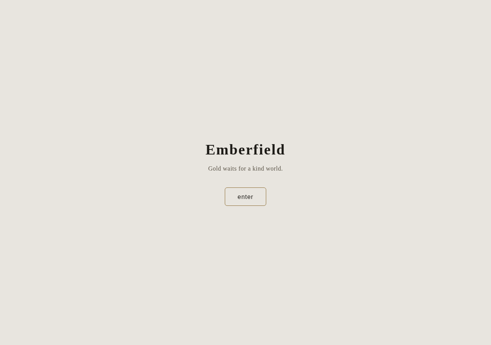
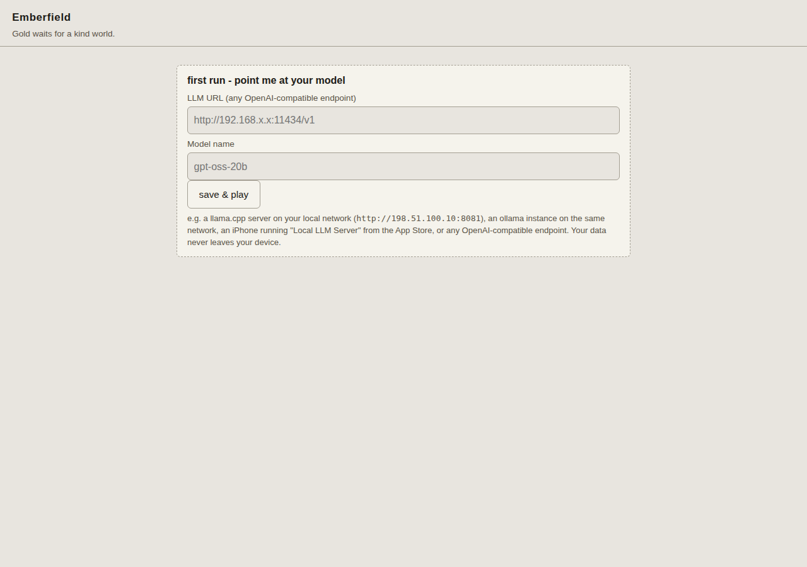

# vefr

[](https://github.com/Rylee-Bee/play-nice-contracts)
[](LICENSE)
[](https://github.com/Rylee-Bee/vefr/actions/workflows/ci.yml)

> *It gives the hellos that never happened.*

**A story engine you run on your own machine. You bring the story. VEFR brings the world.**

VEFR is a lightweight, self-contained game engine for text-driven
playable worlds. It runs a walkable town, NPCs, whispers, items, a
forge, and a bell — all shaped by a **world pack** (a folder of
markdown and JSON that holds your story). The engine and the story
are separate: anyone can take the engine and grow their own world.

No cloud account. No subscription. CPU-only if you want. A small
local model and a folder of markdown is enough to play.






## First 60 seconds

```sh
# 1. Get the engine.
git clone https://github.com/Rylee-Bee/vefr.git
cd vefr
uv sync --group test

# 2. Bring any OpenAI-compatible LLM endpoint.
#    llama.cpp, Ollama, LM Studio, a phone running a local server,
#    or any hosted endpoint that speaks /v1/chat/completions.
export VEFR_LLAMACPP_URL=http://127.0.0.1:8084
export VEFR_MODEL=qwen3-1.7b

# 3. Run with the bundled sample world (Emberfield).
uv run --group test norns validate --pack worlds/sample-world
uv run uvicorn vefr.main:app --app-dir src --port 8820
# -> open http://127.0.0.1:8820
```

Three commands, one engine, one world. To swap in your own world,
see [Make your own world](#make-your-own-world). To play on a
phone or ship a single-file HTML, see [Quickstart](#quickstart-container)
below.

## A Play-Nice project

This repository adopts [Play-Nice Contracts](https://github.com/Rylee-Bee/play-nice-contracts)
as its shared cooperation constitution — truth and evidence before
generating content, explicit state, asking instead of guessing,
and accessibility floors. See the
[adoption record](.project/contracts/adoption.yaml) for details.

## The bones and the flesh

```
src/vefr/           the engine (MPL-2.0)
  paths.py           where things live (VEFR_HOME, VEFR_WORLD)
  world.py           the pack loader - the only seam
  saga.py            the storytelling layer (prompts, voices, ledger)
  generator.py       rumor cards (speaker, whisper, is_true)
  forge.py           items; bonds come from the pack
  stefna.py          sealed voices (the bell / letter)
  npc.py             whisper NPCs; seeds keep the world alive
  combat.py          encounter and combat action surface
  bonds.py           bond contracts and draws
  journey.py         Hero's Journey stage and rune anchors
  runes.py           Elder Futhark rune casts and interpretations
  pool.py            precomputed generation pools for offline play
  weave.py           the weave event log for loader actions
  trace.py           in-memory and JSONL generation call tracing
  sessions.py        multi-session state management
  starred.py         player-marked favorite entries
  chat.py            builder AI interview generator
  inspect.py         pack geometry and contract inspection
  volumes.py         container storage volume configuration
  lore.py            lore pack discovery and rendering
  journal.py         the session journal - what happened, on disk
                     (VEFR_JOURNAL)
  export.py          canon + journal + vault -> one markdown story,
                     deterministic templating, no model needed
  main.py            FastAPI surface incl. GET /api/world,
                     GET /api/journal, GET /api/export
  cli.py             two entry points, ratatoskr (the squirrel) and norns (the weavers):
                       ratatoskr - memory: skipa, test, weave, ferry (deploy, carry, fetch, scaffold)
                       norns - craft: chat, validate, build-map, verify, doctor, handbok
  maplab.py          norns's toolkit - the one validator shared by
                     tests and both clis

worlds/<name>/       a world pack - a story
  world.json         phases, tones, voices, bonds, speakers, the town
  logbok.md          the world logbok - canon + style contract
  ledger.md          collected whispers - voice anchors, hand-curated
  map.md             the story's geometry, source of truth
  voices/*.md        sealed voices (rules only; knowing stays sealed)

worlds/sample-world/ Emberfield - the teaching example (CC0 1.0,
                     ships with the engine so it's shareable end to end)

web/                 parchment UI + canvas town (world-driven)
tests/               pytest - pack contract, schemas, fallbacks
```

No world pack ships tracked in this repo except the sample - the
author's own game keeps its pack in a separate private repo and
drops it into `worlds/<name>/` locally. One env var selects the
world: `VEFR_WORLD=your-world`. Point it at your own pack and the
same engine serves your story.

### Worked example: bones here, flesh in your own repo

The repo split is the contract. The engine knows:

| The engine reads | The engine never reads |
| --- | --- |
| `world.json` keys: title, phases, surface, voices, bonds, acts | the *names* of any specific pack's NPCs, places, or prose |
| `map.md` (geography only - the geometry, not the names) | sample text from any specific pack |
| `voices/*.md` (the rule shape, not the words) | the bell's letter, the keeper's name, your characters |
| pack-name only as an identifier for routes + filenames | any pack's flavor text |

What this looks like in practice:

```
user/vefr/                   # this repo (MPL-2.0, the bones)
user/story-repo/             # your story repo (private, the flesh)
  worlds/your-world/         # the pack, lives in the story repo
    world.json               # phases: dusk / dawn, voices, bonds
    logbok.md                # your canon + style contract
    ledger.md                # collected whispers
    map.md                   # your geometry
    voices/*.md              # your sealed voices
```

You develop the engine here. You write the game there. When you
want to play, drop the pack into `worlds/<name>/` (or `ferry fetch`
it) and set `VEFR_WORLD=<name>` (or `--pull` the existing one).
Restart the engine so the loader re-reads the worlds dir.

When you want to ship the game as your own thing:

```bash
ratatoskr weave --pool 5 --pack sample-world  # one self-contained HTML
```

The packaged file is yours to release. The engine that built it
isn't.

If a future engine contributor (human or AI) reads the source and
sees names that aren't theirs, that's a leak. The bones are
empty until a pack mounts.

## Design

The engine never gates the player on HP, attack, or roll results.
There is no failure state. The bell never rings bad, items can't be
lost, NPCs always have a line. HP bars are a *costume*.

The story structure follows the **Hero's Journey** through four
phases:

| Phase | Journey stage | Rune |
|---|---|---|
| `whispers` | the call to adventure | **Fehu** (wealth, the seed-fire) |
| `doubts` | the refusal / the threshold | **Thurisaz** (the thorn) |
| `feared` | the tests, allies, enemies | **Kenaz** (the torch) |
| `awed` | the revelation / the return | **Sowilo** (the sun) |

Packs can rename their phase keys; the engine maps them by position.
The runes thread through every generation prompt so the LLM's voice
carries the journey shape — but the journey is never a gate.

**Deterministic vs. generative.** Everything except the rune cast
is deterministic — the contract, the packs, the lore, the journal,
the export. The rune cast is the one stochastic surface: same seed
→ same cast within a minute, but the cast is never replayed across
sessions. The tree is the memory. The runes are what the memory
can't capture.

For the full architecture, see
[brain-socket.md](docs/guides/brain-socket.md) (provider vs. brain),
[bundled-brain.md](docs/guides/bundled-brain.md) (zero-setup model
fleet), and the lore packs section below.

### Lore packs

Three lore packs ship with the engine. Each is data — a directory
under `worlds/lore/<name>/` with four markdown files the engine
reads and a fifth the author copies by hand:

| File | Engine reads? | Author reads? |
|---|---|---|
| `textures.md` | yes | yes |
| `names.md` | yes | yes |
| `questions.md` | yes | yes |
| `prompt.md` | no | **yes** (copy-paste into any LLM) |
| `cards.md` (optional, e.g. norse-runes) | yes | yes |
| `LICENSE.md` | no | yes (CC BY-SA 4.0 + attributions) |

The packs:

- **`norse`** — the wandering-poets flavor (skalds, verse in
  place of record, names with weight)
- **`historical-event`** — what the record couldn't hold (real
  events, role-not-name descriptors, the witness)
- **`norse-runes`** — the rune-cast flavor (twenty-four runes in
  three aettir, mapped to the Hero's Journey stages)

To use a pack, call `/api/builder/lore` with the pack name + seed
words, get back the wandering-poets shape (`textures`, `names`,
`questions`) — mood, not canon. Then `norns chat` carries
the mood into the world's interview questions.

To add your own pack: `mkdir worlds/lore/<your-flavor>` and write
the four files. The engine discovers it; no PR required.

### Surface

`world.json` may declare a `surface` field — `combat`,
`investigation`, or `plain`. The surface is the *grammar* the
player sees (HP bars, encounter prompts, investigation dice), not
the engine's actual behavior. Default surface is `combat` for
back-compat with existing packs. A pack that wants the engine's
"no HP, no dice, just the bell and the whispers" experience
declares `surface: "plain"` and the UI knows to skip the
RPG-looking panels.

## Quickstart (container)

```sh
# From the published image (GHCR):
mkdir -p ~/vefr-data
podman run -d --name vefr -p 8820:8820 \
  -v ~/vefr-data:/app/data \
  -e VEFR_LLAMACPP_URL=http://127.0.0.1:8084 \
  -e VEFR_MODEL=qwen3-1.7b \
  ghcr.io/rylee-bee/vefr:latest
curl -s http://127.0.0.1:8820/api/health

# Or build locally:
podman build -t localhost/vefr:latest .
podman run -d --name vefr -p 8820:8820 \
  -v ~/vefr-data:/app/data \
  -e VEFR_LLAMACPP_URL=http://127.0.0.1:8084 \
  -e VEFR_MODEL=qwen3-1.7b \
  localhost/vefr:latest
```

### Container images

Published images live at
`ghcr.io/rylee-bee/vefr`. Tags:

| Tag | Meaning |
|---|---|
| `:latest` | Current `main`, advances on every successful publish |
| `:sha-<full SHA>` | Immutable; the documented rollback handle |

Images are built automatically from `main` after CI passes. The
image contains the engine, web UI, and sample world. For a
bundled-brain deployment (model weights included), see
`docs/guides/bundled-brain.md`.

### Model configuration

VEFR speaks `/v1/chat/completions` to any OpenAI-compatible
endpoint. Point it at llama.cpp, Ollama, LM Studio, or a phone
running a local server.

| Env var | Purpose | Default |
|---|---|---|
| `VEFR_LLAMACPP_URL` | llama.cpp endpoint (preferred) | — |
| `OLLAMA_URL` | Ollama endpoint (fallback) | — |
| `VEFR_MODEL` | Model name sent to the endpoint | `qwen3-1.7b` |
| `VEFR_KEEP_ALIVE` | Ollama model keep-alive window | `1m` |
| `VEFR_HOME` | Engine root directory | `/app` |
| `VEFR_VAULT` | Path to vault.json | `<VEFR_HOME>/data/vault.json` |
| `VEFR_JOURNAL` | Path to journal.json | `<VEFR_HOME>/data/journal.json` |
| `VEFR_WORLD` | World pack name | `sample-world` |

The active Storyteller Pack's `[model].provider` picks the
transport (see `docs/guides/storyteller-packs.md`). Every pack
that ships with the engine is `openai-compatible`, so
`VEFR_LLAMACPP_URL` is the one that matters by default.
`OLLAMA_URL` is only consulted by a pack that declares
`provider = "ollama"`.

### Health and degraded state

`GET /api/health` returns `{"ok": true, "service": "vefr", "purpose": "..."}` when
the engine is running. The health check does **not** require a
model — the engine boots and serves the UI without one. Model-backed
endpoints (`/api/rumor`, `/api/forge`, `/api/npc`, `/api/stefna`)
return errors when no endpoint is configured. The model is
replaceable machinery; the world is authoritative.

### Compose

```sh
# Portable (pulls published image):
podman compose up -d

# Local development (builds from source):
podman compose -f compose.yml -f compose.dev.yaml up --build
```

### Use your own pack

The bundled engine ships with `worlds/sample-world/` (Emberfield) so
it boots with something to play. To swap in your own world:

1. Copy `worlds/sample-world/` to `worlds/<your-name>/`.
2. Edit `world.json`, `logbok.md`, `voices/*.md`, `map.md`. The
   contract lives in `world.json`'s `REQUIRED` keys (see
   `src/vefr/world.py`); `norns validate --pack worlds/<your-name>`
   catches mistakes.
3. Mount it into the container and tell the engine which pack to load:

```sh
podman run -d --name vefr -p 8820:8820 \
  -v ~/vefr-data:/app/data \
  -v /path/to/your-pack:/app/worlds/your-name:Z \
  -e VEFR_WORLD=your-name \
  -e VEFR_LLAMACPP_URL=http://host.docker.internal:8084 \
  localhost/vefr:latest
```

### Bundled brain (zero-setup)

The container ships with a bundled brain — `podman run vefr` gives
you a fully playable game with no external LLM configuration:

| Port | Role | Model | Size |
|---|---|---|---|
| :8083 | Spark | Qwen3-0.6B | ~460 MB |
| :8084 | Storyteller | Qwen3-1.7B | ~1.1 GB |
| :8085 | Vision | SmolVLM2-500M | ~640 MB |
| :8086 | Embeddings | bge-m3 | ~600 MB (optional) |

CPU-only, ~4 GB RAM minimum. See `docs/guides/bundled-brain.md`
for the full architecture, swap guide, and degradation behavior.

### Point it at a phone-as-backend

Anywhere the engine can reach an OpenAI-compatible HTTP endpoint,
the engine is happy. That includes:

- `Local LLM Server` on the iPhone (App Store, iOS 26+) - runs Apple's
  Foundation Models on-device, exposes OpenAI + Ollama APIs
- `Crucible LLM Server` or `Pirate LLM Server` - open-source, llama.cpp
  + Metal, sideloadable via AltStore
- A Mac running Ollama / LM Studio, exposed to your LAN

Set `VEFR_LLAMACPP_URL=http://<phone-ip>:11434/v1` and the game runs
entirely off the laptop, the cloud, and any LAN host.

### Package a single HTML file (the bones)

```sh
ratatoskr weave
# -> dist/sample-world-<date>.html  (one self-contained file)
```

The exported file includes a title screen (world name, tagline,
"enter" button) so it feels like a game within 3 seconds of opening.
No server, no internet — the world's data is baked into the HTML.

The packaged file is the engine's `web/` UI with your world pack
inlined as JSON. Send it to someone - they open it in a browser
(on a phone, on a tablet, on a desktop), point it at any
OpenAI-compatible LLM URL, and play. No Python, no server, no
internet.

## Make your own world

**By hand:**

1. Copy `worlds/sample-world/` to `worlds/yours/` - or start from the
   keys in `world.json` alone.
2. Write your `logbok.md` (canon + the rules the engine must obey)
   and `ledger.md` (seed whispers; the cadence compounds).
3. Define phases and their tones, your bonds, your speakers, your
   town grid and palette.
4. `VEFR_WORLD=yours`. The engine does the rest.

**By conversation** (`norns chat --name yours`): an interview, run
against your own local ollama, drafts the canon, the theme colors,
your phases, bonds, and one speaker's voice - starting from
`worlds/sample-world/` (a known-valid scaffold) so the geometry can
never break. The interview's flow is plain Python, never the model's
call; the model only ever fills in prose or a hex color inside a
schema it can't escape. Every write ends in `maplab.validate()` - you
never have to trust your own edits, the tool always checks. The map
itself stays the scaffold's in v1; grow it after with
`norns build-map --segments`.

## More docs

- **New here?** `GETTING_STARTED.md` - install, run, build your own
  world, no story content required.
- **CLI reference:** `ratatoskr --help` / `norns --help` - the full
  command list, always in sync with the code.
- **Architecture:** `docs/guides/brain-socket.md` - VEFR owns reality,
  brains are swappable, builder AI is proposal-only.
- **API reference:** the running app serves interactive docs for
  free at `/docs` (e.g. `http://127.0.0.1:8820/docs`) - every route,
  every shape, try-it-out included. No separate file to keep in sync.
- **Accessibility:** the Reading & sound panel (title-bar trigger,
  English labels with Norse flavor) lets you set text size, line
  spacing, font, contrast, colorblind-safe palette, motion, focus
  ring, and density. Preferences live in localStorage; a
  share-link button (`Deila`) gives you a URL you can paste into
  another browser to apply them there. Idea credit: Fluid
  Infusion (UI Options pattern), Atkinson Hyperlegible Next +
  OpenDyslexic (SIL OFL, self-hosted under `web/fonts/`). See
  `docs/guides/identity-terms-glossary.md` for the vocabulary.
- **Contributing:** [CONTRIBUTING.md](CONTRIBUTING.md) - the gate
  commands, the architectural principles, the do-not-sweep rules for
  in-flight work.
- **Security & private reporting:** [SECURITY.md](SECURITY.md) -
  private vulnerability reporting, leaked-credential handling,
  threat model, public-private boundary.
- **What's landed, what's next:** `ROADMAP.md`.

## The town

Walk with the pad, WASD, or arrows. `E` or tap talks to whoever is
near. The tower's watch is geometry - safe pockets exist, and the
world's tone narrows them as the phases turn. Gold appears only
when the world is kind.

## Attribution

- Dependencies: fastapi, uvicorn, httpx, pydantic (MIT/BSD-3) -
  declared in `pyproject.toml`; their notices ship in the wheels.
- Model: Qwen (Apache-2.0); outputs are shaped by this repo's
  prompts and reviewed by a human before they become canon.
- Code co-written with Kilo (AI) at the author's direction.
- Idea credits - framing borrowed from projects whose stacks
  didn't fit, with thanks:
  OpenPixel-RPG (MIT) for the whitebox pattern - a deterministic
  blueprint a generative model must respect; RPG-JS (MIT) for
  prompting the render-target contract - any future renderer reads
  `/api/world`; ink + inkjs (MIT) for the authored-branching idea
  shelved for packs.
- Engine license: MPL-2.0 (see `LICENSE`) for the engine source
  under `src/`, `web/`, `tests/`, `scripts/`, `docs/`, `deploy/`,
  and `Containerfile`. Sample world (`worlds/sample-world/`) is
  CC0 1.0 (see its `LICENSE`). Lore mood-boards under
  `worlds/lore/` are CC BY-SA 4.0 (see each pack's `LICENSE.md`).
  Any other world pack dropped into `worlds/<name>/` locally is
  that pack's own author's property - the engine grants no license
  to story content, and carries none in this repo.
- See `THIRD_PARTY_NOTICES.md` for bundled web fonts (SIL OFL 1.1)
  and third-party dependency notices.
- See `TRADEMARKS.md` for fork-naming guidance; project-identity
  rules are descriptive, not a legal grant.

## Development

```sh
uv sync --group test
uv run --group test ruff check src tests scripts
uv run --group test pytest -q \
  --ignore=tests/test_npc_action.py \
  --ignore=tests/test_storyteller_benchmark.py
uv run --group test norns validate --pack worlds/sample-world
python3 scripts/check_public_surface.py
```

The `--ignore` flags match CI — two Storyteller WIP test files
carry known failures tracked in rylee/vefr#50.

The last command is the **public-surface guard** — it fails the
build if the tracked tree contains private LAN IPs, real hostnames,
the operator's SSH user, private filesystem paths, or obvious
credential formats. See [CONTRIBUTING.md](CONTRIBUTING.md) and
[SECURITY.md](SECURITY.md) for the contract.
