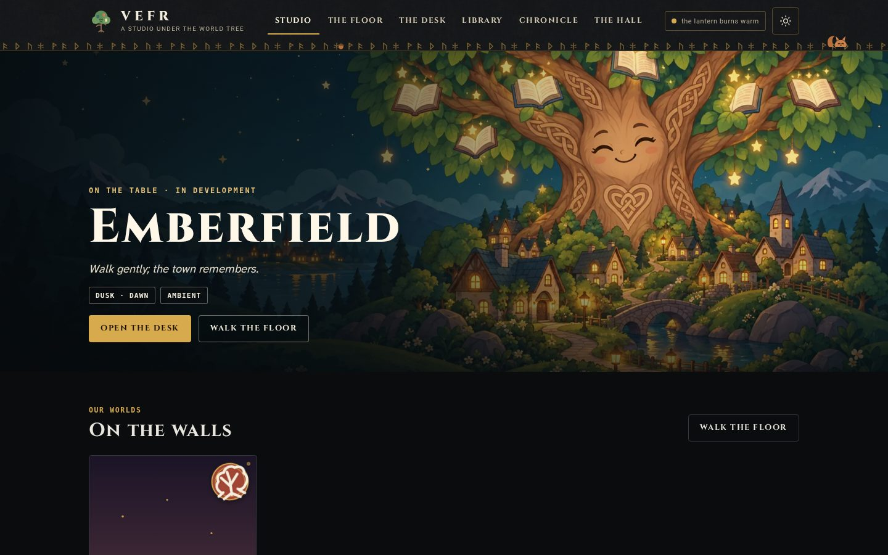
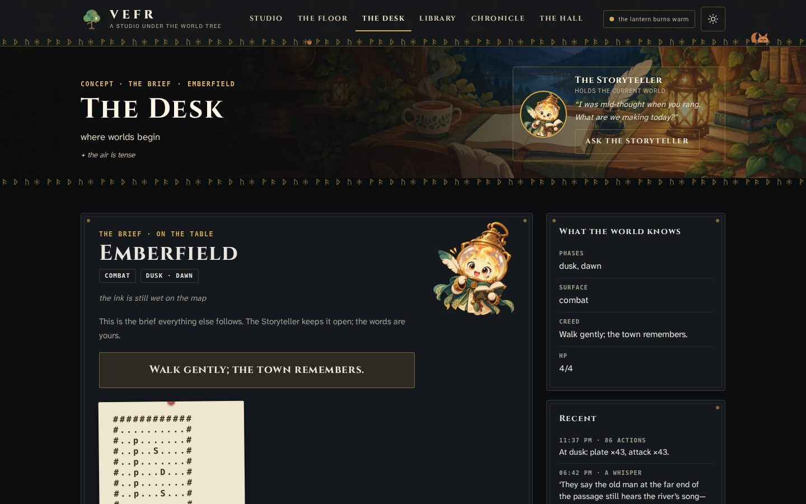
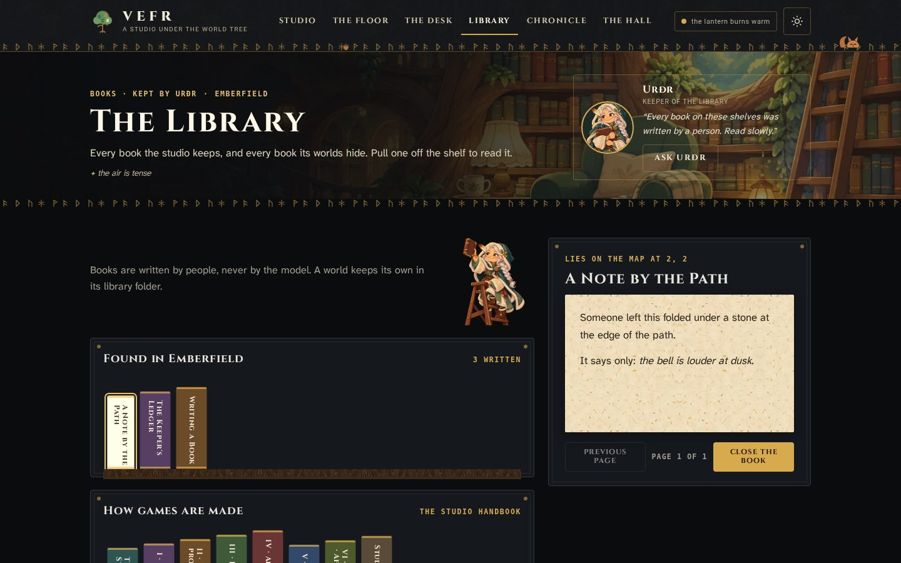
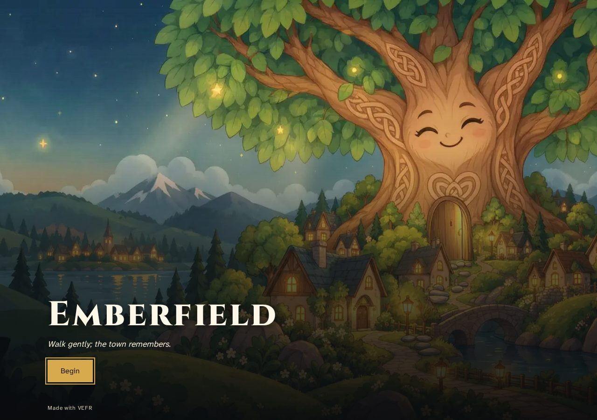
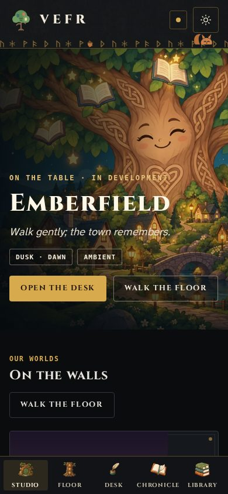

# vefr

[](https://github.com/Rylee-Bee/play-nice-contracts)
[](LICENSE)
[](https://github.com/Rylee-Bee/vefr/actions/workflows/ci.yml)

> *The loom is strung; the world provides the thread.*

**A story engine you run on your own machine. You bring the story. VEFR brings the world.**

VEFR is a small, self-contained engine for story games you can walk
around in: a town to explore, characters to talk to, items to find, and
short lines of story ("whispers") written by a language model. What's in
the world comes from a **world pack**, a folder of markdown and JSON that
holds your story. The engine and the story are kept apart, so anyone can
use the engine to make their own world.

There's no cloud account or subscription, and it runs on a CPU. A small
local model and a folder of markdown are enough to play.

You make games in the **studio**: a game studio run by the old Norse,
inside the World Tree. Each room is a department, and each has a resident
who helps with it.



| | |
|---|---|
| <br>The Desk | <br>The Library |
| <br>The shareable file | <br>On a phone |

**[See every room in the screenshots gallery →](docs/screenshots/README.md)**

Three things to do with it: **[open it and play](#open-and-play)**,
**[build a world](#build-a-world)**, **[run the engine](#run-the-engine)**.

## Open and play

```sh
# 1. Get the engine.
git clone https://github.com/Rylee-Bee/vefr.git
cd vefr
uv sync --group test

# 2. Bring any OpenAI-compatible LLM endpoint.
#    llama.cpp, Ollama, LM Studio, a phone running a local server,
#    or any hosted endpoint that speaks /v1/chat/completions.
export VEFR_LLAMACPP_URL=http://127.0.0.1:8084
export VEFR_MODEL=qwen3-1.7b

# 3. Run with the bundled sample world (Emberfield).
uv run uvicorn vefr.main:app --app-dir src --port 8820
# -> open http://127.0.0.1:8820
```

Walk with the on-screen pad, WASD or the arrow keys. Press `E` or tap
to talk to whoever is nearby. Without a model the engine still runs:
you can walk the town and the journal still records, and anything that
needs the model tells you it isn't loaded.

### Package a single HTML file

```sh
ratatoskr weave
# -> dist/sample-world-<date>.html  (one self-contained file)
```

No terminal? The studio's Desk has a **Make shareable file** button.
It builds the current world the same way and offers a download (or your
phone's Share sheet, where the browser supports sharing files).

The file opens on a title screen with the world's title picture, its
name and tagline, and a Begin button. The game fills the screen, with
speech, choices and health drawn over it and a pause menu (`Esc`) for
the journal. Everything the world needs is inside the file.

Send it to someone and they can play it in any browser, on a phone,
tablet or computer, with no Python, server, internet or model. Models
help while you make the game, in the studio; the finished file is
complete on its own ([ADR 0003](docs/adr/0003-models-in-the-studio.md)).
A game can still offer players an optional model of their own for fresh
lines. The file you make is yours to release; the engine that built it
keeps its own license (MPL-2.0).

### Play a finished demo

**Emberfield**, the sample world, woven with the storybook player (title
screen, in-game menus, plays with no model at all), is a single [release
asset](https://github.com/Rylee-Bee/vefr/releases/download/v2.1.0/emberfield-2026-09-26.html)
in v2.1.0. Download it and open it in any browser.

**Burrito Journalism**, a journalism and taqueria game, is published
as a single [release
asset](https://github.com/Rylee-Bee/vefr/releases/download/v2.0.0/burrito-journalism-2026-09-22.html)
(built with `ratatoskr weave --pool 5`). Download it and open it in any
browser. Point it at an OpenAI-compatible model for live lines, or play
offline with the lines built into the file. The pack is CC BY 4.0; the
engine that built it is MPL-2.0.

## Build a world

A world pack is a folder of markdown and JSON. Two ways in:

**By hand:**

1. Copy `worlds/sample-world/` to `worlds/yours/`, or start from just
   the keys in `world.json`.
2. Write `logbok.md` (your canon and the rules the engine must follow)
   and `ledger.md` (example whispers that set the voice).
3. Define the phases and their tones, relationships, speakers, and the
   town's map and colours.
4. Set `VEFR_WORLD=yours` and start the engine.

**By conversation** (`norns chat --name yours`): an interview with your
local Ollama model drafts the canon, colours, phases, relationships and
one speaker's voice. It starts from a copy of `worlds/sample-world/`, so
the map is always valid. The interview's steps are fixed Python code;
the model only fills in text or a colour inside a strict schema. Every
save runs `maplab.validate()`, so a broken pack is caught immediately.
The map starts as the sample's; reshape it afterwards with
`norns build-map --segments`.

The full walkthrough (every interview question, what happens when the
model fails, reshaping the map, building the file) is in
[`docs/guides/world-creation.md`](docs/guides/world-creation.md).
Which kind of game each act plays (cooking, the newsroom desk) and the
fields that control it (floor, tone, verbs, transitions) are in
[`docs/guides/rulesets.md`](docs/guides/rulesets.md).

### The engine and the pack

The engine never contains story. Here's what it reads and what it
doesn't:

| The engine reads | The engine never reads |
| --- | --- |
| `world.json` keys: title, phases, surface, voices, bonds, acts | the *names* of any specific pack's NPCs, places, or prose |
| `map.md` (geography only - the geometry, not the names) | sample text from any specific pack |
| `voices/*.md` (the rule shape, not the words) | the bell's letter, the keeper's name, your characters |
| pack-name only as an identifier for routes + filenames | any pack's flavor text |

```
src/vefr/           the engine (MPL-2.0)
  world.py           the pack loader - the only seam
  saga.py            the storytelling layer (prompts, voices, ledger)
  generator.py       rumor cards (speaker, whisper, is_true)
  main.py            FastAPI surface (GET /api/world, GET /api/journal,
                     GET /api/export)
  cli.py             two entry points: ratatoskr (ops), norns (craft)
  maplab.py          the one validator, shared by tests and both clis
  ...                forge, stefna, npc, combat, bonds, journey,
                     runes, pool, weave, trace, sessions, starred,
                     chat, inspect, volumes, lore, journal, export,
                     paths - each module's docstring says what it is

worlds/<name>/       a world pack - a story
  world.json         phases, tones, voices, bonds, speakers, the town
  logbok.md          the world logbok - canon + style contract
  ledger.md          collected whispers - voice anchors, hand-curated
  map.md             the story's geometry, source of truth
  voices/*.md        how each character speaks (rules for the model)

worlds/sample-world/ Emberfield, the example world (CC0 1.0, so it can
                     be shared freely)

web/                 the studio workshop (app.html + studio.css + app.js),
                     the woven player (packaged.html), studio art (web/art/),
                     the studio's own Library shelf (web/library/)
tests/               pytest - pack contract, schemas, fallbacks
```

The only world pack in this repo is the sample. Real games keep their
packs in their own repos and are placed in `worlds/<name>/` locally.
`VEFR_WORLD=your-world` selects the world; restart the engine after
adding one. Work on the engine here, and write the game there.

If you find a specific game's names or text inside the engine source,
that's a bug: the engine should know nothing about any game until a
pack is loaded. A test enforces this.

### Design

Each world decides how much the numbers matter. Every act declares a
`floor`:

- `costume` (the default): health is shown as a number but never drops
  to zero. It's decoration.
- `story`: failing changes what happens in the story.
- `stakes`: the numbers really count; the act's ruleset says how.

Under the default, nothing blocks the player on health or dice: items
can't be lost, and characters always have something to say.

The story structure follows the **Hero's Journey** through four
phases:

| Phase | Journey stage | Rune |
|---|---|---|
| `whispers` | the call to adventure | **Fehu** (wealth, the seed-fire) |
| `doubts` | the refusal / the threshold | **Thurisaz** (the thorn) |
| `feared` | the tests, allies, enemies | **Kenaz** (the torch) |
| `awed` | the revelation / the return | **Sowilo** (the sun) |

Packs can rename the phases; the engine matches them by order. Each
phase's rune is included in the model's prompts to set the mood, but
phases never block the player.

**What's random.** Everything is predictable (the packs, lore, journal
and export) except the rune cast. The same seed gives the same cast for
about a minute, and a cast is never repeated across sessions.
Full architecture: [`brain-socket.md`](docs/guides/brain-socket.md)
(provider vs. brain) and [`bundled-brain.md`](docs/guides/bundled-brain.md)
(zero-setup model fleet).

### Lore packs

Three lore packs ship with the engine: mood boards made of data, in
`worlds/lore/<name>/` (**`norse`**, **`historical-event`**,
**`norse-runes`**).

| File | Engine reads? | Author reads? |
|---|---|---|
| `textures.md`, `names.md`, `questions.md` | yes | yes |
| `cards.md` (optional, e.g. norse-runes) | yes | yes |
| `prompt.md` | no | **yes** (copy-paste into any LLM) |
| `LICENSE.md` | no | yes (CC BY-SA 4.0 + attributions) |

Call `/api/builder/lore` with a pack name and some seed words to get
`textures`, `names` and `questions`. They're for mood, not canon;
`norns chat` uses them in its interview. To add your own, make
`worlds/lore/<your-flavor>/` and write the files. The engine finds it
automatically.

### Surface

`world.json` can set a `surface`: `combat` (the default), `investigation`
or `plain`. It only changes what the player sees (health bars, encounter
prompts, investigation dice), not how the engine behaves. A pack that
wants no health or dice at all sets `surface: "plain"`, and the player
hides those panels.

## Run the engine

From the published image (GHCR):

```sh
mkdir -p ~/vefr-data
podman run -d --name vefr -p 8820:8820 \
  -v ~/vefr-data:/app/data \
  -e VEFR_LLAMACPP_URL=http://127.0.0.1:8084 \
  -e VEFR_MODEL=qwen3-1.7b \
  ghcr.io/rylee-bee/vefr:latest
curl -s http://127.0.0.1:8820/api/health

# Or build locally:
podman build -t localhost/vefr:latest .
podman run -d --name vefr -p 8820:8820 \
  -v ~/vefr-data:/app/data \
  -e VEFR_LLAMACPP_URL=http://127.0.0.1:8084 \
  -e VEFR_MODEL=qwen3-1.7b \
  localhost/vefr:latest
```

The image is published at `ghcr.io/rylee-bee/vefr`. `:latest` moves with
every successful publish; `:sha-<full SHA>` never changes, so use it to
roll back. The image holds the engine, the studio and the sample world.
For an image with model weights included, see
[`bundled-brain.md`](docs/guides/bundled-brain.md).

`GET /api/health` returns `{"ok": true, ...}` when the engine is running.
It doesn't need a model: the engine starts and serves the studio without
one. The endpoints that use a model (`/api/rumor`, `/api/forge`,
`/api/npc`, `/api/stefna`) return an error until one is configured.
The model can always be swapped; the world pack is the source of truth.

**Configuration.** Any `/v1/chat/completions` endpoint works: llama.cpp,
Ollama, LM Studio, or a phone on your network. The full
variable table lives in [`GETTING_STARTED.md`](GETTING_STARTED.md);
`example.env` is a fillable copy. Compose, volumes, phone
backends, and pack mounting are covered by
[`docs/guides/install.md`](docs/guides/install.md).

**Your own pack in the container:**

```sh
podman run -d --name vefr -p 8820:8820 \
  -v ~/vefr-data:/app/data \
  -v /path/to/your-pack:/app/worlds/your-name:Z \
  -e VEFR_WORLD=your-name \
  -e VEFR_LLAMACPP_URL=http://host.docker.internal:8084 \
  localhost/vefr:latest
```

**Compose:** `podman compose up -d`. The full guide is in
[`docs/guides/install.md`](docs/guides/install.md) (change the
world, point at an LLM, volumes).

**Built-in models:** a bundled image can include its own small models,
so `podman run vefr` is playable with no model setup (four models,
about 4 GB of RAM, CPU only). Models, ports and how to swap them:
[`docs/guides/bundled-brain.md`](docs/guides/bundled-brain.md).

**CLI:** `ratatoskr --help` (running things) and `norns --help` (making
things) list every command, straight from the code.

## A Play-Nice project

This repository adopts [Play-Nice Contracts](https://github.com/Rylee-Bee/play-nice-contracts)
as its shared working rules: evidence before generating content,
explicit state, asking instead of guessing, and minimum accessibility
standards. See the
[adoption record](.project/contracts/adoption.yaml) for details.

## More docs

- **New here?** `GETTING_STARTED.md`: install, run, and build your own
  world. No story content needed.
- **CLI reference:** `ratatoskr --help` and `norns --help` list every
  command, straight from the code.
- **Architecture:** `docs/guides/brain-socket.md`. VEFR decides what's
  true; models are swappable; the building assistant only ever
  proposes.
- **API reference:** the running engine serves interactive docs at
  `/docs` (for example `http://127.0.0.1:8820/docs`): every route and
  shape, with try-it-out.
- **Accessibility:** the studio's Boiler Room sets the contrast (Warm &
  Easy, Bright & Clear, Nothing Hides), the reading font (Atkinson
  Hyperlegible Next, OpenDyslexic, a serif, or your system font),
  motion and sound. Nothing moves or makes a sound unless you turn it
  on. The fonts are SIL OFL and self-hosted in `web/fonts/`. The
  pattern is credited to Fluid Infusion's UI Options. See
  `docs/guides/accessibility-contract.md` for the rules every screen
  follows.
- **Contributing:** [CONTRIBUTING.md](CONTRIBUTING.md): the checks to
  run, the design principles, and what not to touch while work is in
  progress.
- **Security:** [SECURITY.md](SECURITY.md): private vulnerability
  reporting, what to do about leaked credentials, the threat model,
  and what stays private.
- **What's landed, what's next:** `ROADMAP.md`.

## Attribution

- Dependencies: fastapi, uvicorn, httpx, pydantic (MIT/BSD-3),
  declared in `pyproject.toml`; their notices ship in the wheels.
- Model: Qwen (Apache-2.0); outputs are shaped by this repo's
  prompts and reviewed by a human before they become canon.
- Code co-written with Kilo (AI) at the author's direction.
- Ideas borrowed, with thanks, from projects we didn't build on:
  OpenPixel-RPG (MIT) for the whitebox pattern (a fixed blueprint a
  model must respect); RPG-JS (MIT) for the idea that any future
  renderer reads `/api/world`; ink and inkjs (MIT) for authored
  branching, saved for later.
- Engine license: MPL-2.0 (see `LICENSE`) for the engine source
  under `src/`, `web/` (except `web/art/`), `tests/`, `scripts/`, `docs/`, `deploy/`,
  and `Containerfile`. Sample world (`worlds/sample-world/`) is
  CC0 1.0 (see its `LICENSE`). Lore mood-boards under
  `worlds/lore/` are CC BY-SA 4.0 (see each pack's `LICENSE.md`).
  The workshop's studio art in `web/art/` is CC BY-SA 4.0 (see
  `web/art/README.md`).
  Any other world pack dropped into `worlds/<name>/` locally is
  its own author's property. The engine grants no license
  to story content, and carries none in this repo.
- See `THIRD_PARTY_NOTICES.md` for bundled web fonts (SIL OFL 1.1)
  and third-party dependency notices.
- See `TRADEMARKS.md` for fork-naming guidance; project-identity
  rules are descriptive, not a legal grant.

## Development

```sh
uv sync --group test
uv run --group test ruff check src tests scripts
uv run --group test pytest -q
uv run --group test norns validate --pack worlds/sample-world
python3 scripts/check_public_surface.py
```

The last command is the **public-surface guard**. It fails the build
if the repository contains private network addresses, real hostnames,
the operator's SSH user, private file paths, or anything that looks
like a credential. See [CONTRIBUTING.md](CONTRIBUTING.md) and
[SECURITY.md](SECURITY.md) for the contract.
