# The Journey

VEFR is a game about making a game. You sit down at an empty table in a studio
run by the old Norse, under the World Tree, with a few words about what you want
to make. A few stops later you have a game you made yourself: one file that runs
in any browser, with no server and no model, and you know how every piece got
there because you were in the room for it.

This page is the map. It is a suggested path, not a rule: the engine never makes
you finish one room before you open the next, and a world can start from any of
them. Every stop ends the same way, with something alive you can look at: a map
that checks out, a person who talks, a book on the shelf, a build you can play.

```mermaid
flowchart LR
  A[Arrive] --> B[Desk: say what it is]
  B --> C[Map Room: the first place]
  C --> D[Folks: the first people]
  D --> E[Library: the first book]
  E --> F[Vault: the first thing]
  F --> G[Walk it: the player]
  G --> H[Chronicle: what happened]
  H --> I[Weave: the shareable file]
```

## The stops

You decide. The studio helps. You leave with something. That is the whole deal at
every stop. Models draft and suggest; you keep, change or bin every line, and the
story stays yours.

| # | Stop | You decide | The studio helps | You leave with |
|---|---|---|---|---|
| 1 | **Arrive** (the Studio and the Floor) | What kind of game, and whose | The Floor shows every department, one door each | A world on the table (a copy of the sample world is a fine start) |
| 2 | **The Desk** | The pitch and the creed: what the game is for, in your words | The Desk pins the brief, the creed and the map where you can see them | A brief you could read aloud to a friend |
| 3 | **The Map Room** | Where it starts and what is near | Regions, a survey, and a drawing table; the validator checks the map every time | A map that is valid and walkable |
| 4 | **The Folks** | Who lives here and how they sound | Inviting a new face; voice notes drive how each person speaks | One person worth talking to |
| 5 | **The Library** | What is written down and what is found | The world's books and the studio handbook; Fróði keeps the shelves | A book on the shelf |
| 6 | **The Vault** | What the hero can carry and keep | The forge, and a place for what you've kept | An item that does something |
| 7 | **Walk it** (the player) | How it feels: movement, doors, light, the dark | `norns validate`, then a real build you can open and play | A build that moves |
| 8 | **The Chronicle** | Nothing: you read what happened | Urðr keeps the record in words | A journal of your own play |
| 9 | **Weave** | Whether it is ready to send | The Desk's **Make shareable file** button, or `ratatoskr weave` | One self-contained file for a friend |

Two things hold across every stop:

- **Validate before you move on.** `uv run norns validate --pack worlds/<name>`
  tells you whether geometry, reachability and voices all pass. It is the one
  check, shared by the tests and both command-line tools.
- **Small beats big.** One feature at a time, each one finished well enough to
  play, is how a game gets made without anyone losing a month to it.

## Lessons log

Each lesson is one thing learned while making a game on VEFR, written down while it
is fresh. Add one per feature: what you tried, what surprised you, what you would
tell a friend. Keep the engine's own rule in mind: examples here use the sample
world (Emberfield), because the engine never learns the name of any particular
game.

| Date | Stop | Lesson |
|---|---|---|
| *(first entry lands with the first feature built through this loop)* | | |

## For AI assistants working in this repo

If you are an agent helping with a pack or an engine feature, the map above is also
your orientation. The rules that keep it fun and safe:

- **The story is the author's.** Build machinery, draft only when asked, label every
  draft as a draft, and never promote an idea into canon.
- **The engine stays neutral.** No game's names, places or prose in `src/`; the
  pack contract (`src/vefr/world.py`) is the only seam, and changing it is
  *ask first* (see `AGENTS.md`).
- **Every change ends alive.** Validate the pack, build something playable or
  readable, and show the result. A feature without a playable demo in the sample
  world is not finished.
- **Write it down.** One feature means a guide section for a stranger and a line in
  the lessons log above.

Where to go next: [GETTING_STARTED.md](../../GETTING_STARTED.md) to run it,
[world-creation.md](world-creation.md) for the full walkthrough of making a world,
[rulesets.md](rulesets.md) for what each act can play, and
[residents.md](residents.md) for who is in the studio.
